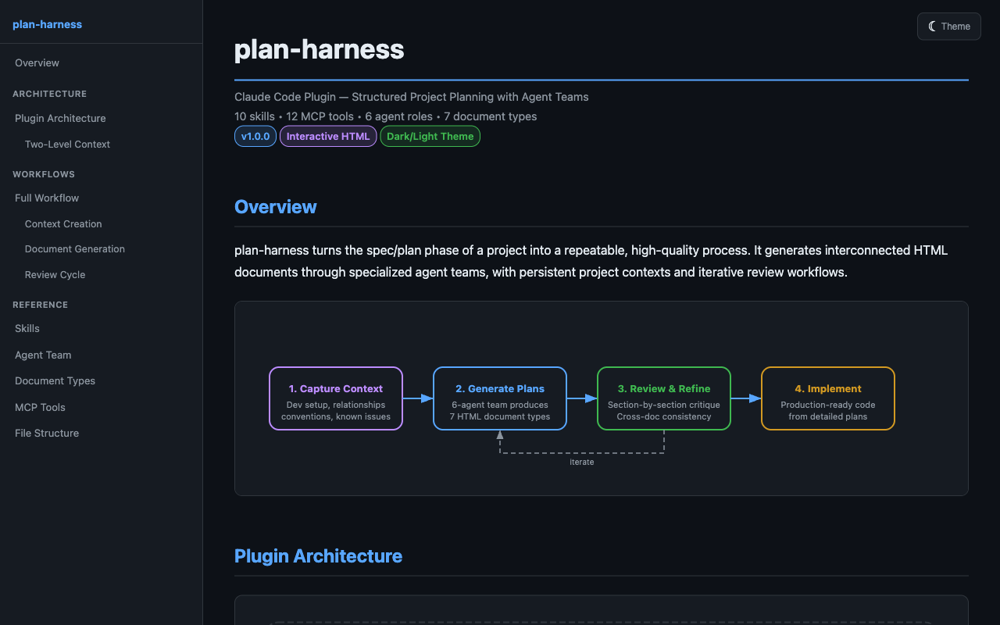
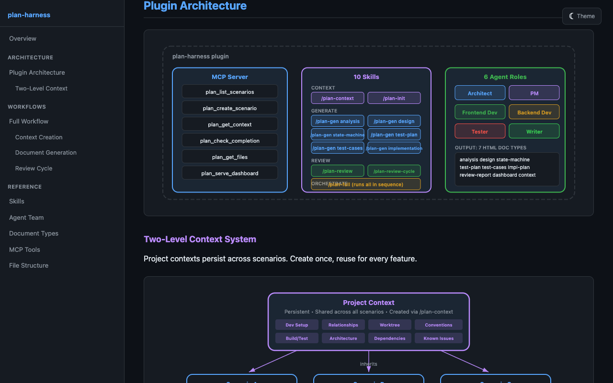

**English** · [简体中文](README.zh.md)

---

# plan-harness

A Claude Code plugin that turns the spec / plan phase of a project into a repeatable, high-quality process. Specialized agent teams generate interconnected HTML plan documents — design, state-machines, test plans, test cases, implementation plans — with composable markdown contexts that adapt the output to your project, scenario, and style.

## Install

```bash
# 1. Add the marketplace
claude plugin marketplace add https://github.com/wangcansunking/can-claude-plugins

# 2. Install the plugin
claude plugin install plan-harness@can-claude-plugins

# 3. In any Claude Code session, bootstrap a planning workspace
/plan-context init          # import built-in context templates
/plan-init                  # multi-select contexts + create a scenario
/plan-gen                   # generate docs (multi-select UI)
```



## Why

Most "AI design doc" tools run a single prompt against a vague brief. plan-harness is the opposite: a layered context + multi-agent pipeline that produces documents you can actually ship.

- **Context decides everything.** Composable `.md` contexts capture project paths, conventions, API maps, and generation rules. The more specific the context, the better the plan.
- **A real agent team**, not one prompt. Architect, PM, Frontend Dev, Backend Dev, Tester, Writer — each agent sees only the slice of context it needs.
- **One dispatcher**, seven doc types. `/plan-gen` picks any subset (design, state-machine, test-plan, test-cases, implementation, test-report, analysis) via a multi-select UI or CLI argument.
- **Interactive HTML**, fully self-contained. Every generated file inlines all CSS + JS. Zero CDN, zero deps. Open in any browser, print to PDF, share with teammates.
- **Review + revise loop.** Section-by-section critiques, cross-doc consistency checks, and batched writer-agent proposals on reviewer comments.
- **Shareable.** One command publishes a plan-set via devtunnel — public, private, or password-protected — without leaving Claude Code.

## Features

### Unified `/plan-gen` dispatcher

One command generates any plan document. Pick one or several types via a multi-select UI, or pass a type directly:

```
/plan-gen                   # interactive multi-select
/plan-gen design            # just design.html
/plan-gen design test-plan  # design + test-plan, in topological order
/plan-gen all               # delegate to /plan-full
```

Dependencies between doc types (design → state-machine / test-plan → test-cases / test-report) are resolved automatically so downstream docs read the freshly generated upstream output.

### Plugin architecture at a glance



Three pieces: an MCP server with 12 tools, 10 slash commands, and 6 agent roles. They compose to produce 7 kinds of HTML output.

### Two-level context system

Contexts are composable markdown files. A project-level context (paths, build commands, conventions) stays persistent across every scenario; scenario-level contexts layer on top with the specifics of one feature. Later contexts override earlier ones on conflict.

```
devxapps-project.md          (project: build, conventions, architecture)
  + portal-admin-pages.md    (scenario: specific pages, APIs, baselines)
  + performance-audit.md     (rules: 4 docs, Tokyo Night, anti-patterns)
  = effective context for this plan
```

Each context `.md` uses frontmatter (`name`, `description`, `tags`, `agents`) so only the agents that care see it — keeps the prompt tight.

### Review + revise loops

- `/plan-review` walks a doc section-by-section and dispatches role-specific reviewers.
- `/plan-review-cycle` runs the full review matrix across every doc in the scenario and flags cross-doc contradictions.
- `/plan-revise` batches all pending revise-intent comments and dispatches the writer agent to propose verbatim replacements, which surface as "Proposal ready" chips in the dashboard.

### End-to-end execution via Playwright MCP

`/plan-test` reads the scenarios listed in `test-plan.html` and drives them against a live dashboard through Playwright MCP — the real UI, not synthetic fetches — so the run catches UX regressions that API-level smoke tests miss.

### Share without leaving Claude Code

`/plan-share` wraps devtunnel so you can push a plan-set to a short-lived public URL (or a password-protected private one) in one step. The tunnel self-maintains while the scenario is live.

## Slash Commands

| Command | What it does |
|---|---|
| `/plan-context` | Create, list, edit, import context files |
| `/plan-init` | Multi-select contexts + create / select a scenario |
| `/plan-gen` | Unified generator — pick any subset of doc types |
| `/plan-full` | Orchestrate the whole workflow with checkpoints |
| `/plan-sync` | Cascade-regenerate downstream docs after upstream edits |
| `/plan-test` | Run `test-plan.html` scenarios end-to-end via Playwright MCP |
| `/plan-share` | Share plan docs via devtunnel (public / private / password) |
| `/plan-review` | Section-by-section review of one document |
| `/plan-review-cycle` | Full review with cross-document consistency |
| `/plan-revise` | Batch-dispatch pending revise-intent comments into writer proposals |

## MCP Tools

12 tools via a local stdio server — surfaces the filesystem and dashboard operations the slash commands need:

| Tool | Purpose |
|---|---|
| `plan_list_scenarios` | Scan workspace for all scenarios with file inventory |
| `plan_create_scenario` | Create scenario directory with manifest |
| `plan_get_files` | List plan files with metadata |
| `plan_check_completion` | Check implementation progress from code evidence |
| `plan_get_context` | Analyze codebase: tech stack, patterns, conventions |
| `plan_serve_dashboard` | Start local HTTP dashboard at `localhost:3847` |
| `plan_share` | Start a devtunnel for a scenario (public / private / password) |
| `plan_share_stop` | Stop an active devtunnel |
| `plan_reanchor` | Repair drifted W3C-style anchors after doc edits |
| `plan_list_pending_revises` | List revise-intent comments awaiting a writer proposal |
| `plan_list_pending_mentions` | List @-mention comments queued for agent personas |
| `plan_post_persona_reply` | Post a persona reply to a queued @-mention thread |

## Agent Team

| Role | Prompt | Focus |
|------|--------|-------|
| **Architect** | `prompts/architect-prompt.md` | Data models, API contracts, SVG diagrams, dependency graphs |
| **PM** | `prompts/pm-prompt.md` | Requirements, user stories, acceptance criteria, scope |
| **Frontend Dev** | `prompts/frontend-dev-prompt.md` | Components, state management, routing, accessibility |
| **Backend Dev** | `prompts/backend-dev-prompt.md` | API implementation, data access, services, deployment |
| **Tester** | `prompts/tester-prompt.md` | E2E scenarios, test cases, coverage matrices |
| **Writer** | `prompts/writer-prompt.md` | HTML assembly, CSS themes, sidebar nav, cross-references |

## Repository Layout

```
plan-harness/
  .claude-plugin/plugin.json         Plugin metadata
  .mcp.json                          MCP server wiring
  contexts/                          Built-in context templates (feature-planning, performance-audit, lean)
  prompts/                           6 agent role templates
  skills/                            10 skill definitions (SKILL.md each)
  local-proxy/                       Node MCP server + web dashboard
    start.js                         Bootstrap (auto-installs deps)
    src/
      index.js                       MCP server (12 tools, stdio)
      plan-manager.js                Plan file operations
      web-server.js                  HTTP dashboard (node:http)
      templates/base.js              Self-contained HTML template system
  docs/
    overview.html                    Static plugin overview (rendered in the screenshots above)
    context-design.md                Context system design document
    screenshots/                     Images used by this README
```

## Development

Clone and run from source:

```bash
git clone https://github.com/wangcansunking/plan-harness
cd plan-harness/local-proxy
npm install
npm run dev                 # build + sync to Claude Code plugin cache
```

Other scripts (all inside `local-proxy/`):

```bash
npm run build               # esbuild src → dist/index.js
npm run sync                # copy working tree into the Claude Code cache
npm run prepare-release     # install + build (pre-commit / release)
```

See [DEVELOPMENT.md](DEVELOPMENT.md) for the full working-copy ↔ plugin-cache dance, including the optional symlink-to-working-copy trick for zero-copy edits.

## Changelog

See [CHANGELOG.md](CHANGELOG.md).
