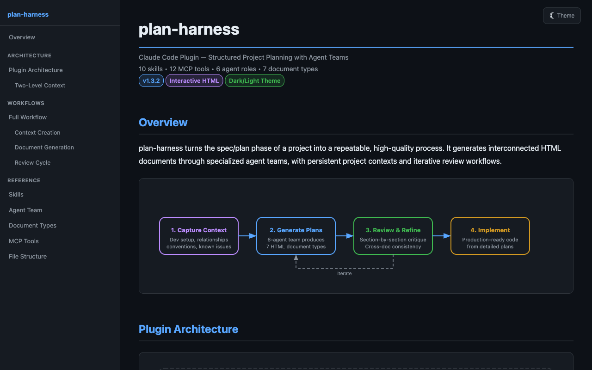
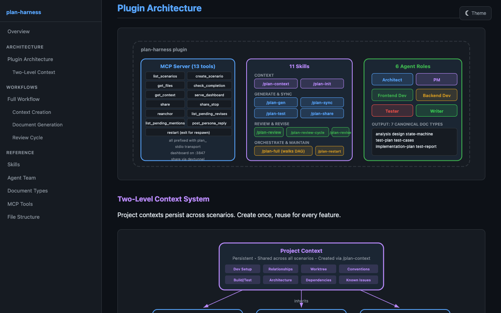

**English** · [简体中文](README.zh.md)

---

# plan-harness

A Claude Code plugin that turns the spec / plan phase of a project into a repeatable, high-quality process. Specialized agent teams generate interconnected HTML plan documents — PRD, analysis, design, state-machines, test specs, implementation plans, test reports — backed by a structured `meta.json` source-of-truth per doc, with composable markdown contexts that adapt the output to your project, scenario, and style.

## Install

```bash
# 1. Add the marketplace
claude plugin marketplace add https://github.com/wangcansunking/can-claude-plugins

# 2. Install the plugin
claude plugin install plan-harness@can-claude-plugins

# 3. In any Claude Code session, bootstrap a planning workspace
/plan-context init          # import built-in context templates
/plan-init                  # multi-select contexts + create a scenario
/plan-gen                   # generate docs (multi-select UI)
```

### Dogfood / local development

Hacking on plan-harness itself? Install it straight from your local clone as a marketplace — no publish step, and `/reload-plugins` picks up changes as you edit:

```bash
# 1. Clone (once)
git clone https://github.com/wangcansunking/plan-harness ~/repos/plan-harness

# 2. Register the local checkout as a marketplace
claude plugin marketplace add ~/repos/plan-harness

# 3. Install from that local marketplace
claude plugin install plan-harness@can-claude-plugins

# 4. After editing skills / prompts / commands, reload in-session
/reload-plugins
```

The plugin cache mirrors `dist/index.js` (committed), so the local-proxy MCP server runs without a build step. If you change `local-proxy/src/*`, run `cd local-proxy && npm run dev` to rebuild + sync the cache.



## Why

Most "AI design doc" tools run a single prompt against a vague brief. plan-harness is the opposite: a layered context + multi-agent pipeline that produces documents you can actually ship.

- **Context decides everything.** Composable `.md` contexts capture project paths, conventions, API maps, and generation rules. The more specific the context, the better the plan.
- **A real agent team**, not one prompt. Architect, PM, Frontend Dev, Backend Dev, Tester, Writer — each agent sees only the slice of context it needs.
- **Meta as source of truth.** Every doc has a `<doc>.meta.json` SoT plus an HTML view that re-embeds it byte-for-byte. Downstream agents read structured upstream meta — not散 prose — so generation stays deterministic.
- **Three-phase generation.** Phase A drafts meta silently from upstream + code; Phase B grills the user one field at a time; Phase C renders the HTML view. Skip Phase B with `--no-grill` when you want speed over quality.
- **One dispatcher**, 7 scenario doc types + 3 shared repo assets. `/plan-gen` picks any subset (product, analysis, design, state-machine, test-spec, implementation, test-report, plus shared `context` / `glossary` / `decisions`) via a multi-select UI or CLI argument.
- **Hash-based cascade.** `/plan-sync` compares `metaHashes` to find stale downstream docs and runs a diff-aware grill that only re-asks the fields actually affected by an upstream change. `/plan-edit` lets you tweak a single doc's fields without cascading.
- **Interactive HTML**, self-contained. Every generated file inlines CSS + JS. Open in any browser, print to PDF, share with teammates. Mermaid and SVG diagrams render offline.
- **Auto-served dashboard.** `/plan-init` starts a local HTTP server on `localhost:3847` and opens the workspace dashboard automatically. Root-absolute links (`/<scenario>/<doc>.html`) keep cross-doc navigation working.
- **Review + revise loop.** Section-by-section critiques, cross-doc consistency checks, and batched writer-agent proposals on reviewer comments.
- **Shareable.** One command publishes a plan-set via devtunnel — public, private, or password-protected — without leaving Claude Code.

## Features

### Unified `/plan-gen` dispatcher

One command generates any plan document. Pick one or several types via a multi-select UI, or pass a type directly:

```
/plan-gen                        # interactive multi-select
/plan-gen design                 # just design.html (+ meta.json)
/plan-gen analysis design        # both, in topological order
/plan-gen all                    # delegate to /plan-full
/plan-gen design --no-grill      # skip Phase B (faster, lower quality)
```

Dependencies (product → analysis → design → {state-machine, test-spec} → implementation → test-report) are resolved automatically so downstream docs read freshly generated upstream meta. See [§Canonical workflow](#canonical-workflow) below.

### Canonical workflow

```
product  →  analysis  →  design  ┬─►  state-machine  ─┐
                                  ├─►  test-spec  ◄────┤
                                  └─►  implementation ◄┤
                                            └─►  test-report ◄─┘
```

Hard (required) vs. soft (optional) edges:

| Doc | Required upstream | Optional upstream |
|---|---|---|
| `product` | — | `_shared/glossary` |
| `analysis` | `product` | `_shared/{context, glossary, decisions}` |
| `design` | `analysis` | — |
| `state-machine` | `design` | — |
| `test-spec` | `design` | `state-machine` |
| `implementation` | `design` | `state-machine`, `test-spec` |
| `test-report` | `test-spec` | `implementation` |

Shared assets (`context`, `glossary`, `decisions`) live in `plan-harness/_shared/` and surface via a header link on every scenario doc. They're never on the scenario DAG — `/plan-sync` flags scenarios with stale shared-asset hashes but doesn't auto-cascade them (to avoid noise).

`/plan-gen` topologically sorts whatever subset you pick. `/plan-full` walks the whole thing with review checkpoints. `/plan-sync` cascades a single upstream edit down to every affected doc using `metaHashes` diffs. `/plan-edit` tweaks one doc's fields without cascading.

### Plugin architecture at a glance



Three pieces: an MCP server with 13 tools, 11 slash commands, and 6 agent roles. They compose to produce 7 kinds of HTML output.

### Two-level context system

Contexts are composable markdown files. A project-level context (paths, build commands, conventions) stays persistent across every scenario; scenario-level contexts layer on top with the specifics of one feature. Later contexts override earlier ones on conflict.

```
devxapps-project.md          (project: build, conventions, architecture)
  + portal-admin-pages.md    (scenario: specific pages, APIs, baselines)
  + performance-audit.md     (rules: 4 docs, Tokyo Night, anti-patterns)
  = effective context for this plan
```

Each context `.md` uses frontmatter (`name`, `description`, `tags`, `agents`) so only the agents that care see it — keeps the prompt tight.

### Review + revise loops

- `/plan-review` walks a doc section-by-section and dispatches role-specific reviewers.
- `/plan-review-cycle` runs the full review matrix across every doc in the scenario and flags cross-doc contradictions.
- `/plan-revise` batches all pending revise-intent comments and dispatches the writer agent to propose verbatim replacements, which surface as "Proposal ready" chips in the dashboard.

### End-to-end execution via Playwright MCP

`/plan-test` reads the scenarios listed in `test-plan.html` and drives them against a live dashboard through Playwright MCP — the real UI, not synthetic fetches — so the run catches UX regressions that API-level smoke tests miss.

### Share without leaving Claude Code

`/plan-share` wraps devtunnel so you can push a plan-set to a short-lived public URL (or a password-protected private one) in one step. The tunnel self-maintains while the scenario is live.

## Slash Commands

| Command | What it does |
|---|---|
| `/plan-context` | Create, list, edit, import context files |
| `/plan-init` | Multi-select contexts + create / select a scenario; auto-starts dashboard server |
| `/plan-gen` | Unified generator — pick any subset of doc types; runs Phase A draft → Phase B grill → Phase C render |
| `/plan-full` | Orchestrate the whole workflow with checkpoints |
| `/plan-sync` | Hash-diff cascade — regenerate only the downstream fields actually affected by an upstream edit |
| `/plan-edit` | Local edit of one doc's fields via a hint (no cascade) |
| `/plan-test` | Run `test-spec.html` scenarios end-to-end via Playwright MCP |
| `/plan-share` | Share plan docs via devtunnel (public / private / password) |
| `/plan-review` | Section-by-section review of one document |
| `/plan-review-cycle` | Full review with cross-document consistency |
| `/plan-revise` | Batch-dispatch pending revise-intent comments into writer proposals |
| `/plan-restart` | Exit the MCP server so Claude Code respawns it on the newly-installed bundle |

## MCP Tools

13 tools via a local stdio server — surfaces the filesystem, dashboard, and self-restart operations the slash commands need:

| Tool | Purpose |
|---|---|
| `plan_list_scenarios` | Scan workspace for all scenarios with file inventory |
| `plan_create_scenario` | Create scenario directory with manifest |
| `plan_get_files` | List plan files with metadata |
| `plan_check_completion` | Check implementation progress from code evidence |
| `plan_get_context` | Analyze codebase: tech stack, patterns, conventions |
| `plan_serve_dashboard` | Start local HTTP dashboard at `localhost:3847` |
| `plan_share` | Start a devtunnel for a scenario (public / private / password) |
| `plan_share_stop` | Stop an active devtunnel |
| `plan_reanchor` | Repair drifted W3C-style anchors after doc edits |
| `plan_list_pending_revises` | List revise-intent comments awaiting a writer proposal |
| `plan_list_pending_mentions` | List @-mention comments queued for agent personas |
| `plan_post_persona_reply` | Post a persona reply to a queued @-mention thread |
| `plan_restart` | Exit the MCP server process for Claude Code to respawn (picks up new plugin bundles) |

## Agent Team

| Role | Prompt | Focus |
|------|--------|-------|
| **Architect** | `prompts/architect-prompt.md` | Data models, API contracts, SVG diagrams, dependency graphs |
| **PM** | `prompts/pm-prompt.md` | Requirements, user stories, acceptance criteria, scope |
| **Frontend Dev** | `prompts/frontend-dev-prompt.md` | Components, state management, routing, accessibility |
| **Backend Dev** | `prompts/backend-dev-prompt.md` | API implementation, data access, services, deployment |
| **Tester** | `prompts/tester-prompt.md` | E2E scenarios, test cases, coverage matrices |
| **Writer** | `prompts/writer-prompt.md` | HTML assembly, CSS themes, sidebar nav, cross-references |

## Repository Layout

```
plan-harness/
  .claude-plugin/plugin.json         Plugin metadata
  .mcp.json                          MCP server wiring
  contexts/                          Built-in context templates (feature-planning, performance-audit, lean)
  prompts/                           6 agent role templates + 3 shared mixins
    _html-base.md                    HTML skeleton, palette, sidebar shape, meta-embed contract
    _grill-mixin.md                  Phase B interview rules (adapted from mattpocock/skills)
    _caveman-mixin.md                Caveman-style render priorities
  skills/                            Slash command definitions (SKILL.md each)
    plan-gen/types/                  Per-doc-type contracts (product, analysis, design, ...)
  local-proxy/                       Node MCP server + web dashboard
    start.js                         Bootstrap (auto-installs deps)
    src/
      index.js                       MCP server (stdio)
      plan-manager.js                Plan file operations (v1 + v2)
      manifest-v2.js                 v2 manifest: schemaVersion, metaHashes, hash util
      web-server.js                  HTTP dashboard (node:http) — serves both plan-harness/ and plans/
      templates/base.js              Self-contained HTML template system
  docs/
    overview.html                    Static plugin overview
    context-design.md                Context system design document
    screenshots/                     Images used by this README
```

Scenarios you generate land in your target repo:

```
<target-repo>/
  plan-harness/                      v2 root (preferred; new scenarios go here)
    _shared/                         Cross-scenario assets (header link)
      context/                       Code architecture
      glossary/                      Domain language
      decisions/                     ADRs
      dashboard.html                 Workspace dashboard
    <scenario-slug>/
      manifest.json                  schemaVersion: 2, metaHashes, upstreamHashes
      product.{meta.json, html}
      analysis.{meta.json, html}
      design.{meta.json, html}
      state-machine.{meta.json, html}
      test-spec.{meta.json, html}
      implementation.{meta.json, html}
      test-report.{meta.json, html}
  plans/                             v1 root (legacy; read-only, still served)
```

## Development

Clone and run from source:

```bash
git clone https://github.com/wangcansunking/plan-harness
cd plan-harness/local-proxy
npm install
npm run dev                 # build + sync to Claude Code plugin cache
```

Other scripts (all inside `local-proxy/`):

```bash
npm run build               # esbuild src → dist/index.js
npm run sync                # copy working tree into the Claude Code cache
npm run prepare-release     # install + build (pre-commit / release)
```

See [DEVELOPMENT.md](DEVELOPMENT.md) for the full working-copy ↔ plugin-cache dance, including the optional symlink-to-working-copy trick for zero-copy edits.

## Changelog

See [CHANGELOG.md](CHANGELOG.md).
